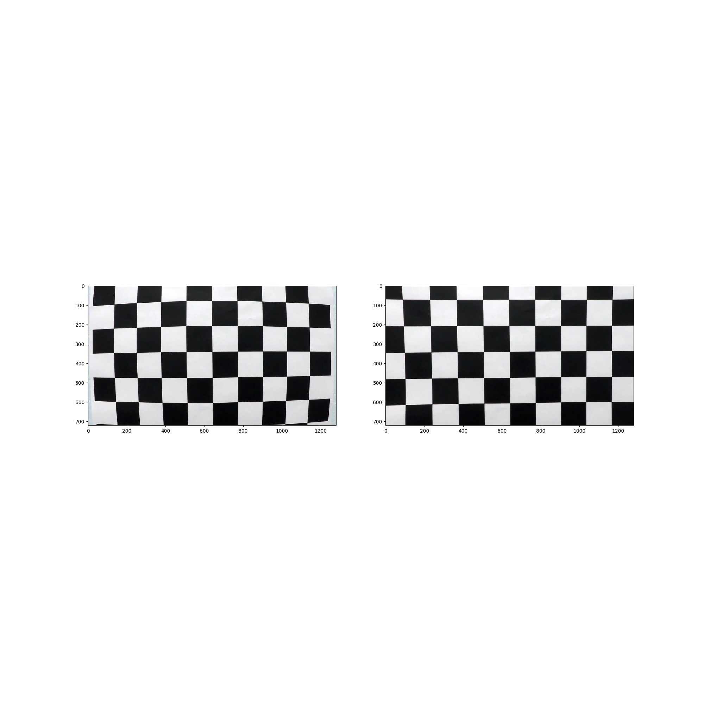
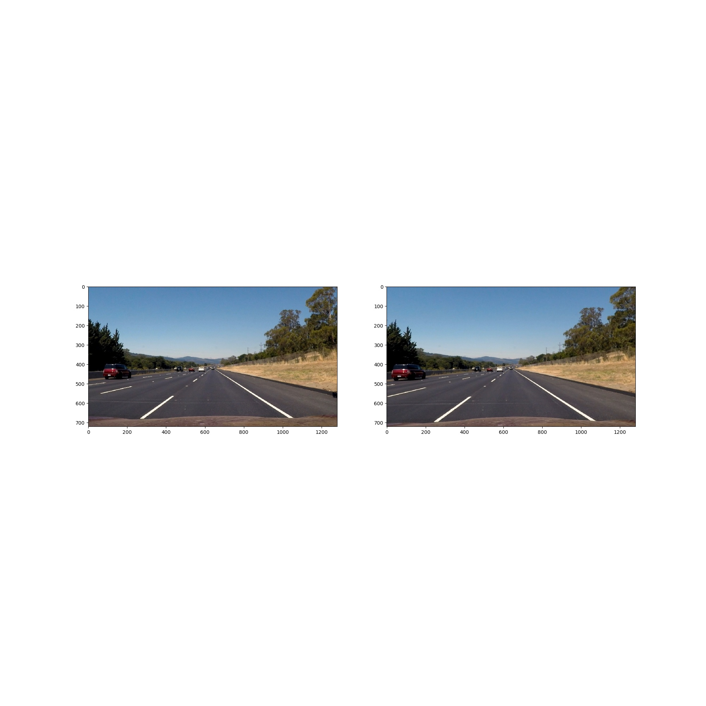
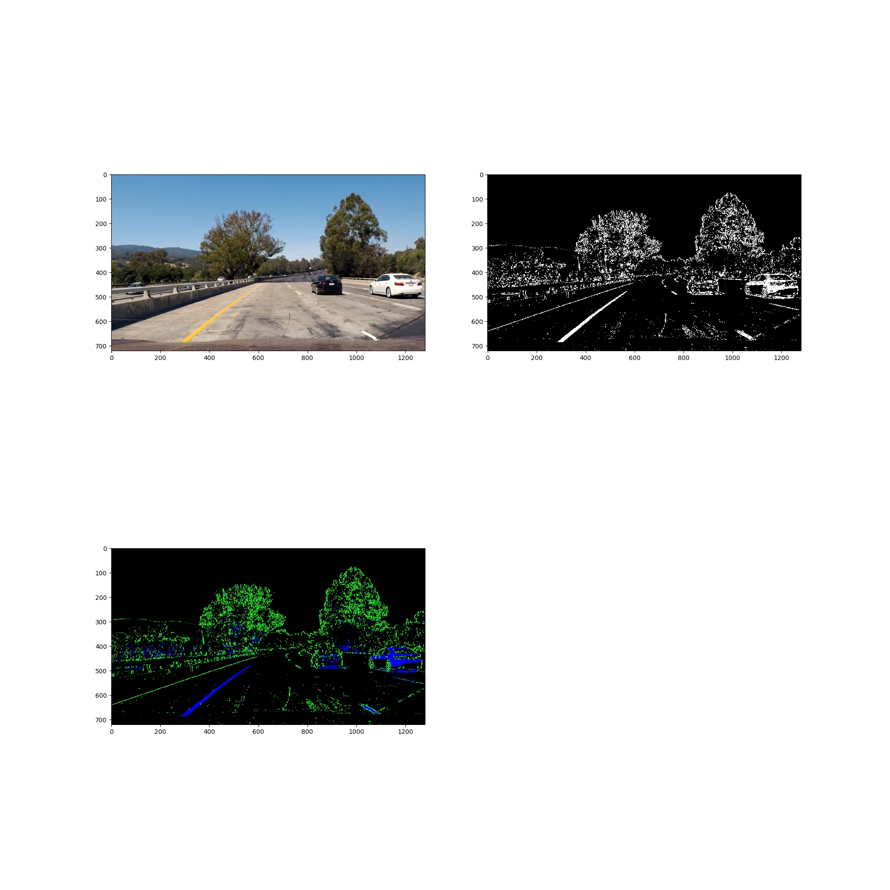
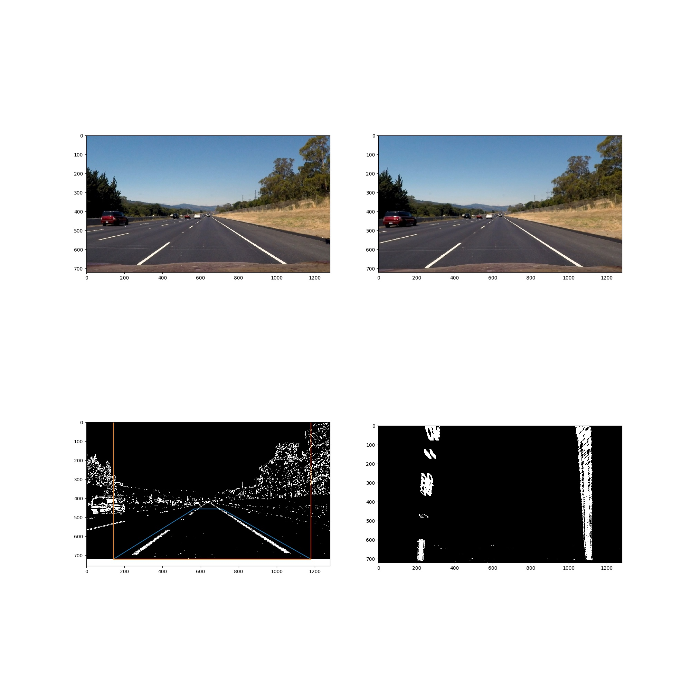
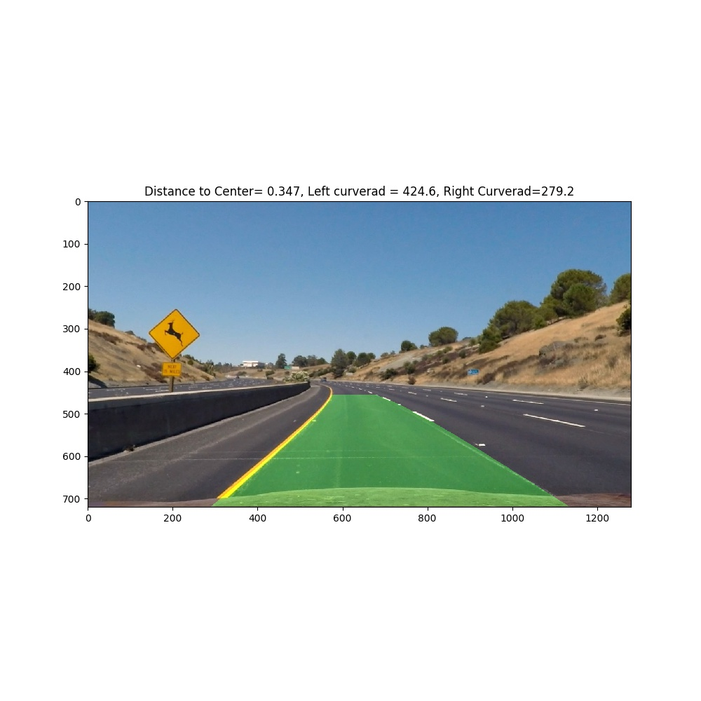

# Project : Advanced lane line finding


**Advanced Lane Finding Project**

The goals / steps of this project are the following:

* Compute the camera calibration matrix and distortion coefficients given a set of chessboard images.
* Apply a distortion correction to raw images.
* Use color transforms, gradients, etc., to create a thresholded binary image.
* Apply a perspective transform to rectify binary image ("birds-eye view").
* Detect lane pixels and fit to find the lane boundary.
* Determine the curvature of the lane and vehicle position with respect to center.
* Warp the detected lane boundaries back onto the original image.
* Output visual display of the lane boundaries and numerical estimation of lane curvature and vehicle position.

[//]: # (Image References)

[image1]: ./examples/undistort_output.png "Undistorted"
[image2]: ./test_images/test1.jpg "Road Transformed"
[image3]: ./examples/binary_combo_example.jpg "Binary Example"
[image4]: ./examples/warped_straight_lines.jpg "Warp Example"
[image5]: ./examples/color_fit_lines.jpg "Fit Visual"
[image6]: ./examples/example_output.jpg "Output"
[video1]: ./project_video.mp4 "Video"

## [Rubric](https://review.udacity.com/#!/rubrics/571/view) Points

### Here I will consider the rubric points individually and describe how I addressed each point in my implementation.  

---

### Writeup / README

#### Briefly discuss any problems / issues you faced in your implementation of this project. Where will your pipeline likely fail? What could you do to make it more robust?

The main issue and problems I had in my implementation is properly thresholding the lane lines when there is different lighting, road color and lane color. Also, in the harder examples I struggled with my implementation to find the proper starting point when I fit the polynomial (I found the starting point by using a histogram).
I think the overall pipeline would be more robust if the thresholding used to generate a binary map of the lane lines was better.

### Camera Calibration

#### 1. Briefly state how you computed the camera matrix and distortion coefficients. Provide an example of a distortion corrected calibration image.

I start by preparing "object points", which will be the (x, y, z) coordinates of the chessboard corners in the world. Here I am assuming the chessboard is fixed on the (x, y) plane at z=0, such that the object points are the same for each calibration image.  Thus, `objp` is just a replicated array of coordinates, and `objpoints` will be appended with a copy of it every time I successfully detect all chessboard corners in a test image.  `imgpoints` will be appended with the (x, y) pixel position of each of the corners in the image plane with each successful chessboard detection.  

I then used the output `objpoints` and `imgpoints` to compute the camera calibration and distortion coefficients using the `cv2.calibrateCamera()` function.  I applied this distortion correction to the test image using the `cv2.undistort()` function and obtained this result: 


The left side is the undistorted image, and the right image is the distortion-corrected image.

### Pipeline (single images)

#### 1. Provide an example of a distortion-corrected image.

To undistort the image, I first compute the camera calibration and distortion coefficients as explained above. Then I apply distortien correction on a test image and obtain this result: 

The left side is the undistorted image, and the right image is the distortion-corrected image.

#### 2. Describe how (and identify where in your code) you used color transforms, gradients or other methods to create a thresholded binary image.  Provide an example of a binary image result.

I used a combination of HLS thresholding on the S-channel, as well as a sobel filter on the x-axis to generate the binary thresholded image. The code can be seen in `src/thresholding.py`. 
Here's an example of my output for this step.


In the left top corner is the input image. In the right top corner is the output binary map.
In the left bottom corner is a visualization showing the green colors the lines caught by the sobelx thresholding, and the blue color showing the thresholding on the S-Channel in the HLS image.

#### 3. Describe how (and identify where in your code) you performed a perspective transform and provide an example of a transformed image.
The code for my perspective transform is located in `src/perspective_transform.jpg`. The function `perspective_transform()` takes in a grayscale image, and performs perspective transform. The source points, and the destination points are hardcoded in the image as: 


```python
src = np.float32([
    (width*310//700, height*19//30),
    (width*390//700, height*19//30),
    (width*83//90, height),
    (width*10//90, height),
    (width*31//70, height*19//30),
])
dst = np.float32([
    (width*10//90, 0),
    (width*83//90, 0),
    (width*83//90, height),
    (width*10//90, height),
    (width*10//90, 0),        
])
```

I verified that my perspective transform was working as expected by drawing the `src` and `dst` points onto a test image and its warped counterpart to verify that the lines appear parallel in the warped image.



The top row shows the input image, as well as the distortion-corrected image(to the right). 
The bottom left image shows the binary-thresholded image with the blue box showing the source points, and the orange points showing the destination points. 
To the bottom right is the final output of the perspective transform. 

#### 4. Describe how (and identify where in your code) you identified lane-line pixels and fit their positions with a polynomial?
The main pipeline for lane-line finding is located in line 172 - 211 in `src/lane_finding.py`. 
This takes in the original image `img`, together with the warped image `warped`. Then I follow the pipeline:

If there is no previous frame, I fit a new polynomial to the warped image by using a histogram search on the bottomo of the image to find the starting position, then using a sliding window approach to search for the lane line. 

If there is a previous frame I already have a fitted polynomial which I can use to simplify my search by looking around this polynomial with a certain margin. 


Then by these results I verify that the lane-lines are correct by confirming that both (1) the curverad of both the lines are within 10% of eachother, and (2) that the lane-lines are not crossing. This logic is found in `should_reset`. 
By tracking how many frames in a row that has been incorrect, I do a hard reset if this count is above 10.

When I have confirmed that my found polynomial fits are correct, I track the results and take the mean of the last 20 frames to get a smoothed estimate of the lane lines. 

Finally, I map the results on the original image by using the function `map_lane_lines_to_original`. 


#### 5. Describe how (and identify where in your code) you calculated the radius of curvature of the lane and the position of the vehicle with respect to center.
The radius of curvature is calculated in `measure_curvature` which is in line 260-272 in `lane_finding.py` I compute the left_fit and right_fit in the correct cordinate frame, then find the curvature shown the function  `curvature(...)`. 

To compute the distance of the vehicle with respect to the center I find the position of the center of the lane by looking at y=0 for a frame, then computing the distance between the right and the left lane. By using this distance and assuming a lane is 3.7m, we can compute the number of meters per pixel. 
By knowing this, and the lane lines position in pixels, I compute the estimated center of the lane lines in the image in meters. Then I assume the car is centered in the image, and the position of this in the x-direction is the width of the image in pixels, multiply this with the xm_per_pixels and then take the half. With these two position we can find the absolute value of the difference between them, which is the distance. 


#### 6. Provide an example image of your result plotted back down onto the road such that the lane area is identified clearly.

To map the lane lines to the road, I implemented this in `map_lane_lines_to_original(..)` in line 274 in `lane_finding.py`. Here is an example of my result on a test image:



---

### Pipeline (video)

#### 1. Provide a link to your final video output.  Your pipeline should perform reasonably well on the entire project video (wobbly lines are ok but no catastrophic failures that would cause the car to drive off the road!).

Here's a [link to my video result](output_videos/project_video_out.mp4)

---

### Discussion

#### 1. Briefly discuss any problems / issues you faced in your implementation of this project.  Where will your pipeline likely fail?  What could you do to make it more robust?

I think the main struggle of my pipeline is extracting the binary image. I'm using a very simple approach with thresholding on the S-channel in HLS images, and the sobelx  thresholding. 
I think my pipeline is robust in other areas, such as the smoothing and reset functions of it.

The pipeline fails when there is a lot of change of light, and when there is a lot of irregularities in the road such as cracks. 

To make the pipeline more robust I think working on the binary image thresholding can improve it a lot, and also work on how the initial estimates of the line is calculated. Currently we are using a histogram approach, but it has no domain knowledge. Such as using the information that the lines should be seperated with x pixels, can help the choice of initial starting position.